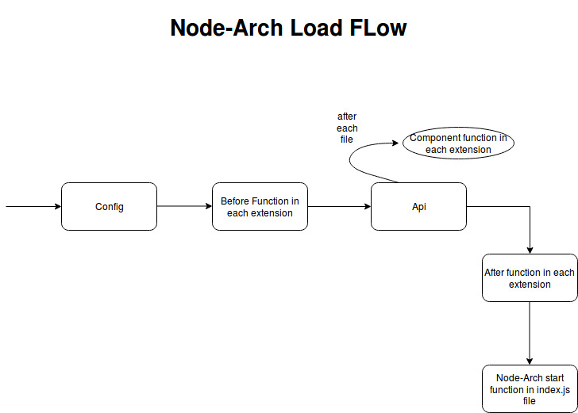

<a href="http://nodearch.io/"></a>

[




## Components

- [Configuration](#configuration)

- [Extensions](#extensions)

  - Before
  - Component
  - After

- [Main Project](#main-project)

  - Plugins
  - Specification

- [index.js](#index)

- [nodearch.json](#nodearch.json)

- [Other Features](#other-features)

  ------

### Configuration

- It should contain folders based on the node environment.

       example: if ``` node_env = "develpoment" ```, then the configuration folder should contain a  `development` folder.

- Files that are not in any environment folder are loaded by default in all environments.
- Files inside the environment folders override the default ones.
- To Access the configuration within the project, see the [Main Project](#to-access-any-file-within-the-project)

------

### Extensions

- Extensions act as a middle-ware to be able to use different modules within any project.
- For example you can use **Mongo** or **MySql**, you can use for testing **Mocha** or **Lab**.
- You can find some or our pre-defined extensions [here](htttps://google.com.eg)
- Extensions should expose one (or more) of the three functions **Before**, **Component**, **After** where each function takes the [configuration](#configuration) as parameters.
  - **Before:** Executed before the framework tries to load any of the files of the project (except for the configuration).
  - **Component:** Executed after each sing file while being loaded.
  - **After:** Executed after all the project files are loaded.

Example for a **before** function to use mongoose to initialize database connection.

```javascript

'use strict';

const _ = require('lodash');
const mongoose = require('mongoose'); 
mongoose.Promise = Promise;

const { config, log } = require('nodearch');


module.exports = {

  before: function () {
    return new Promise((resolve, reject) => {

      if (!config || !config.mongoose) {
        return reject(new Error('mongoose configurations not found!'));
      }

      const { url, options } = config.mongoose;

      if (!url) {
        return reject(new Error('mongo url not found in the mongoose configuration file!'));
      }

      mongoose.connect(url, options);

      const db = mongoose.connection;
      db.on('error', (err) => reject(err));

      db.once('open', () => {
        log.info('Connected To MongoDB');
        return resolve(db);
      });

    });
  }
};
```

------

### Main Project

- Main project is structured inside the `api` folder.

- Inside the api folder there will be plugins, where each plugin is a folder.

- Each plugin can be structured as the user want. If you use our [generator](htttps://google.com.eg) you can create the folders directly.

- **specification.json**

  - It specifies the order of loading of files.

  - It's used to determine the order of loading of plugins or the order of loading of each item inside each plugin (depending on the directory it's found in).

  - Example for specification.json inside a plugin

    ```json
    [
      {
        "name": "models",
        "type": "component"
      },
      {
        "name": "schema",
        "type": "component"
      },
      {
        "name": "services",
        "type": "component",
        "modules": [
        ]
      },
      {
        "name": "controllers",
        "type": "component",
        "modules":[
        ]
      },
      {
        "name": "routes.js",
        "type": "module"
      },
      {
        "name": "test",
        "type": "component",
        "disable": true
      }
    ]

    ```

    Each JSON object is either a **module** (file) or a **component** (folder)

    For each component, you can specify the order of loading of its **modules** (files) through the modules array.

- #### To access any file within the project

    use the `deps` object on `nodearch` module.

- Example: If inside your api, we have `pluginOne`, `pluginTwo`, each plugin contains `services`.

  ```javascript
  var nodearch = require('nodearch');
  var services = nodearch.deps.pluginOne.services; //services in pluginOne
  var config = nodearch.config; //configuration based on node environment
  ```


------

### Index

- Contains the start of the server library you use (hapi, express, ..etc).
- Example for start for **hapi:** 


------

### nodearch.json

- Contains the extensions for your project

  ```json
  {
    "extensions": [
      "mocha-arcjs-ext",
      "mongoose-arcjs-ext"
    ]
  }
  ```

------

### Other Features

- **Pipelines:** 
  - Takes functions as arguments & executes them in sequence.
  - If any function throws an error, pipeline stops.
  - Each function takes arguments initialized in the pipeline
  - The pipeline returns the result of the last function in the pipeline.


<hr>
<br>
<b>sponsored by:</b><br>
<a href="https://www.trufla.com/"></a>